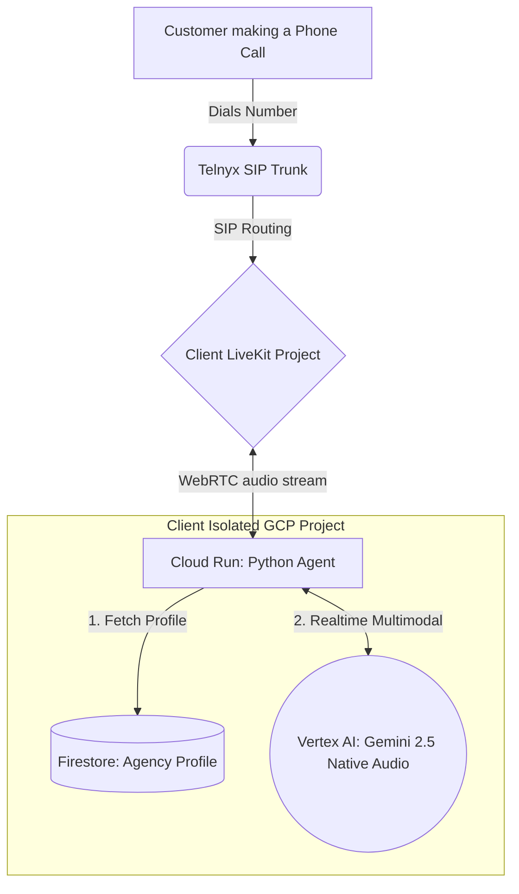

# Front-Desk Telephony Architecture

This document outlines the architecture and tenancy model for the **Front-Desk Telephony** application, part of the **Insure-Assist** ecosystem.

## Core Philosophy: Single-Tenant, Shared-Codebase

To satisfy strict enterprise compliance and data privacy requirements for the insurance industry, this application uses a **Single-Tenant, Shared-Codebase** model. 

- **The Code is Monolithic:** There is exactly one version of the `agent.py` code.
- **The Infrastructure is Siloed:** Every client agency gets their own completely isolated infrastructure stack. No client data, memory, or audio streams ever cross paths.

## Infrastructure Mapping (Per Client)

For each client (e.g., *Wilcock, Filley and Associates*), the following highly isolated stack is provisioned:

1. **GCP Project:** `insure-assist-[client_name]-prod`
    - Hosts the Python agent (e.g., deployed on Google Cloud Run).
    - Hosts a Firestore Database containing the client's **Knowledge Base (KB) Profile** (Agent name, tone, custom greeting, company history, services provided, contact info).
    - Handles IAM permissions and Application Default Credentials (ADC) specifically tied to Vertex AI.
2. **LiveKit Project:**
    - A dedicated project under the master LiveKit Cloud account.
    - Generates unique API Keys and Webhook URLs specifically for this client.
3. **Telephony (Telnyx):**
    - Dedicated phone numbers purchased through Telnyx.
    - An isolated SIP Trunk configured to route inbound calls to the specific LiveKit Project's SIP URI.

## The Call Flow

1. **Inbound Call:** A customer dials the agency's dedicated phone number.
2. **SIP Routing:** Telnyx receives the call and forwards the SIP traffic to the client's dedicated LiveKit Project.
3. **Agent Wake-Up:** LiveKit triggers the Python agent running inside the client's isolated GCP Project (Cloud Run).
4. **Context Injection:** The Python agent wakes up, queries its local GCP Firestore for the `agency_profile`, and dynamically injects the agency's name, tone, and specific instructions into the prompt.
5. **Real-Time Reasoning:** The agent connects to Google's **Gemini 2.5 Flash Native Audio** model via Vertex AI. Because it runs inside the client's GCP Project, it seamlessly inherits the Application Default Credentials (no hardcoded API keys).
6. **Interaction:** The agent conducts a hyper-low-latency, speech-to-speech conversation (handling interruptions/barge-ins natively) speaking as the agency's dedicated front-desk receptionist.

## Diagram

## Developer Notes

When running locally for testing:
* The `.env` file must point to a specific, sandboxed LiveKit Project.
* Authentication to Gemini relies on the `GOOGLE_GENAI_USE_VERTEXAI="true"` flag combined with your active `gcloud auth application-default login --project=insure-assist-dev` state.
